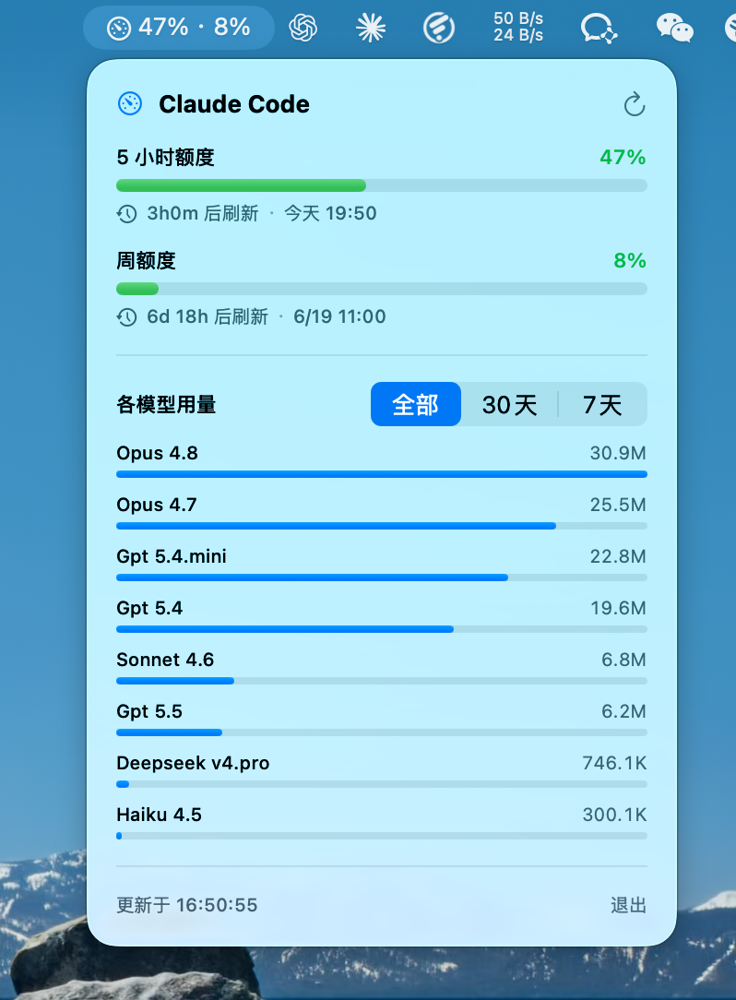

# ClaudeMeter

> 支持 **macOS 14 (Sonoma) 及以上**

一个 macOS **菜单栏 App**，实时监测 Claude 的额度使用情况：

- 🕔 **5 小时额度** 利用率 + 精确刷新时间（倒计时）
- 📅 **周额度** 利用率 + 精确刷新时间（倒计时）
- 🤖 **各模型用量**（按 全部 / 30天 / 7天 分别统计的 token 消耗）—— 不只是 Claude（Opus / Sonnet / Haiku），**凡是经 Claude Code 跑过的模型都会被统计到**：通过路由 / 代理接入的 GPT、Deepseek 等第三方模型同样会按模型名分别累计

额度数据与 Claude Code 里 `/usage` 命令完全一致 —— 不是估算，而是来自官方额度接口。

## 截图



```
菜单栏:  ⏲ 4% · 3%
         点开 ▼
┌─────────────────────────────┐
│ 5 小时额度        ▓▓░░░░░  4% │
│ ⏱ 1h23m 后刷新 · 今天 11:50  │
│ 周额度           ▓░░░░░░  3% │
│ ⏱ 6d 后刷新 · 6/19 03:00     │
│ ─────────────────────────── │
│ 各模型用量  [全部｜30天｜7天]  │
│ Opus 4.8   ▓▓▓▓▓     1.2M    │
│ Sonnet 4.6 ▓▓        0.3M    │
└─────────────────────────────┘
```

## 数据来源

| 数据 | 来源 |
|------|------|
| 5h / 周额度利用率 + 刷新时间 | 官方接口 `GET https://api.anthropic.com/api/oauth/usage`，用 Claude Code 存在 **登录钥匙串**（service `Claude Code-credentials`）里的 OAuth token 认证 |
| 各模型 token 用量 | 本地 transcript `~/.claude/projects/**/*.jsonl` 中每条 assistant 消息的 `usage` 字段（增量扫描，按 `model` 字段聚合）。因为是按消息里写的模型名统计，所以经 Claude Code 调用的**任何**模型（含路由 / 代理接入的 GPT、Deepseek 等）都会自动出现，无需额外配置 |

> **隐私**：所有处理都在本机完成。App 只读取你自己的钥匙串凭证和本地记录，仅向 `api.anthropic.com` 发起你自己的额度查询，不上传任何数据到第三方。

### 非订阅用户

5h / 周额度是 **Claude 订阅（Pro/Max）** 专有的概念。若用 API Key / Bedrock / Vertex 或未登录，App 会自动隐藏额度区，只显示本地各模型用量（这部分与认证方式无关，始终可用）。

## 架构

```
Shared/
  UsageModels.swift       数据模型 + 本地快照缓存
  ClaudeUsageAPI.swift    读钥匙串 token + 调额度接口
  LocalTokenScanner.swift 增量扫 JSONL，累计总量 + 按天分桶聚合各模型 token
  DataStore.swift         编排：拉额度 + 扫 token → 组装快照
  Formatting.swift        数字 / 时间格式化
App/
  ClaudeMeterApp.swift    MenuBarExtra 入口（LSUIElement，无 Dock 图标）
  AppState.swift          每 60s 轮询，发布快照
  MenuContentView.swift   下拉面板（进度条 + 倒计时 + 各模型）
```

App 不沙盒（需读另一个 App 的钥匙串和 `~/.claude` 记录），Developer ID 分发、非 App Store。

刷新策略：菜单栏每 60s 拉额度并即时显示；较重的 token 扫描节流到每 5 分钟。扫描状态和快照缓存在 `~/Library/Application Support/ClaudeMeter/`。

## 构建与运行

需要 macOS 14+、Xcode 16+、[XcodeGen](https://github.com/yonyz/XcodeGen)。

```bash
brew install xcodegen
git clone <your-repo> && cd ClaudeMeter

# 1. 填入你的 Apple Developer Team ID（也可在 Xcode 里设置）
#    编辑 project.yml -> settings.base.DEVELOPMENT_TEAM

xcodegen generate           # 生成 ClaudeMeter.xcodeproj
open ClaudeMeter.xcodeproj   # 选 ClaudeMeter scheme，Run
```

首次运行会弹一次**钥匙串授权框**（“ClaudeMeter 想访问 Claude Code-credentials”），点 **始终允许** 即可。

> 改 bundle id 前缀时，需同步改两处：`project.yml` 和 `Shared/UsageModels.swift` 的 `AppConfig.bundlePrefix`。

## License

MIT
